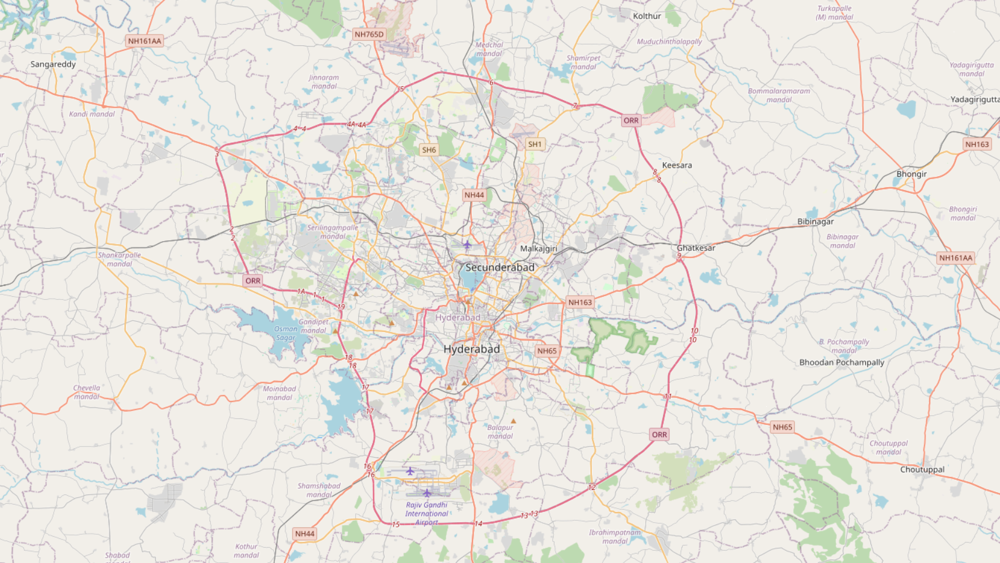
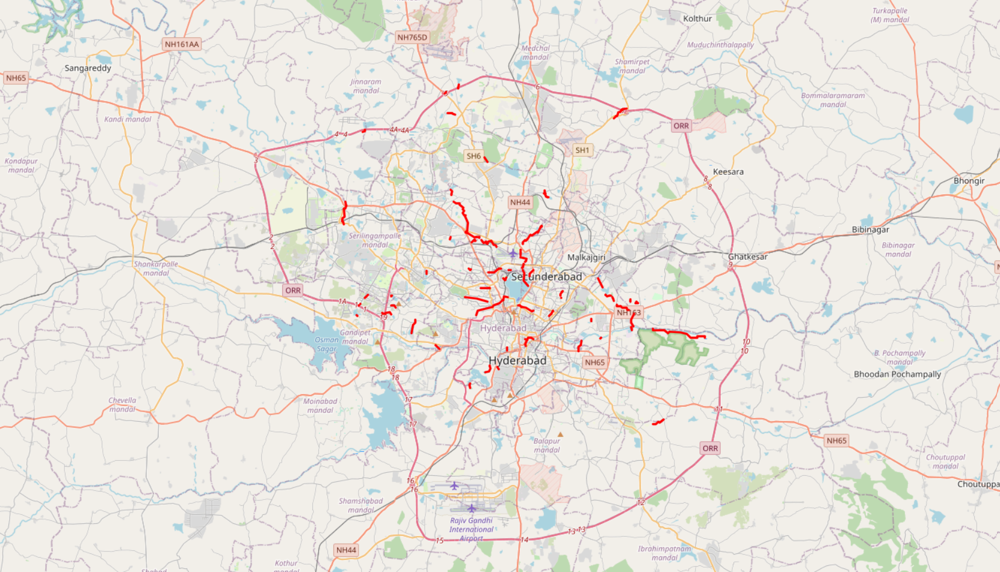

# Hyderabad-Flood-Risk-Predictor
An EVT-based (Extreme Value Theory / Probability Model) urban flood risk prediction system for Hyderabad. This project takes raw elevation data, land-use maps, and historical rainfall, calculates surface water runoff, and identifies failure points in the city's drainage network to predict flood zones.

## 🚀 Features
* **3D Elevation Processing:** Converts raw NASA `.hgt` DEM files into usable topographical maps.
* **Surface Runoff Calculation:** Analyzes OpenStreetMap (OSM) land-use data to determine the absorption rates of concrete vs. green spaces.
* **Hydrological Routing:** Uses slope and catchment mapping to simulate the downhill flow of rainwater.
* **Infrastructure Stress Testing:** Cross-references water flow with the city's drainage network to pinpoint overflow risks.
* **Interactive Mapping:** Serves the final risk zones on an interactive local web interface.
---

## How to Reproduce the Model

### 1. Download base data
Run:
python scripts/download_data.py

Download Hyderabad GeoJSON from Overpass Turbo and save to:

data/hyderabad_landuse.geojson

### 2. Build GIS layers
Run:
python scripts/geojson_to_landuse.py

python models/flow/catchment_mapper.py

python models/flow/sample_elevation.py

python models/flow/orient_by_slope.py

### 3. Run the full flood model
Run:
python run_flood_model.py

python web/app.py

### 4. Open:
http://127.0.0.1:5000

## Live Flood Map

